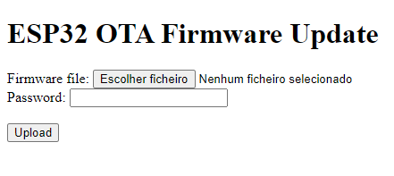

# OTA

### Owner: Guilherme Araujo

## Configuração

``` c++
// main.cpp
OTA::begin();
```

``` c++
// server
// página inicial de envio do .bin
const httpd_uri_t index_get = {
    .uri = "/",
    .method = HTTP_GET,
    .handler = OTA::index_get_handler,
    .user_ctx = NULL};

// rota que atualiza o firmware
const httpd_uri_t ota_update_firmware = {
    .uri = "/ota_update_firmware",
    .method = HTTP_POST,
    .handler = OTA::ota_update_firmware_post_handler,
    .user_ctx = NULL};
```

## Partition table

Precisa ter a partição **factory** do subtipo **ota** e as partições **ota_0** e **ota_1**

```
// Exemplo partitions.csv
...
factory,data,ota,,8K,,
ota_0,app,ota_0,,1000K,,
ota_1,app,ota_1,,1000K,,
...
```

## Exemplo de página de update

### Usage: 
1. Compilar código alterado
2. Enviar o arquivo **.bin** localizado na pasta **build** do projeto
3. Upload

<div align=center>

<p> Página de envio de firmware </p>
</div>
